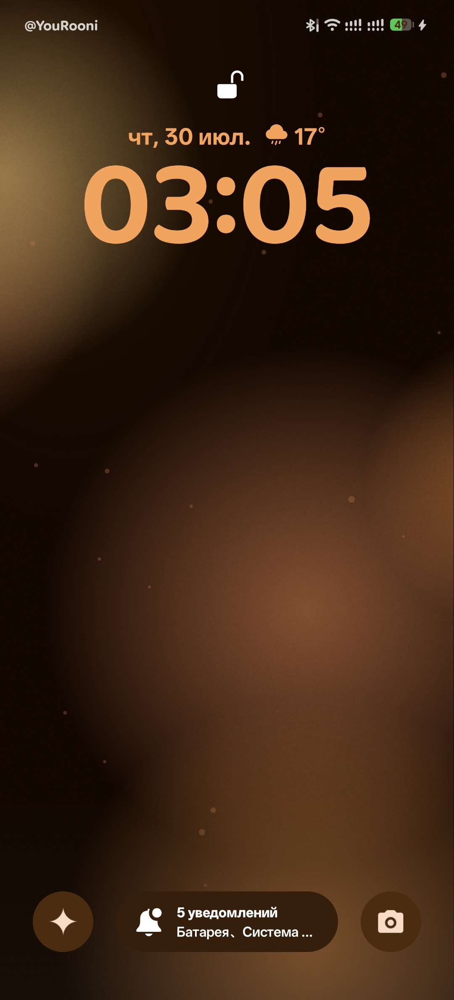
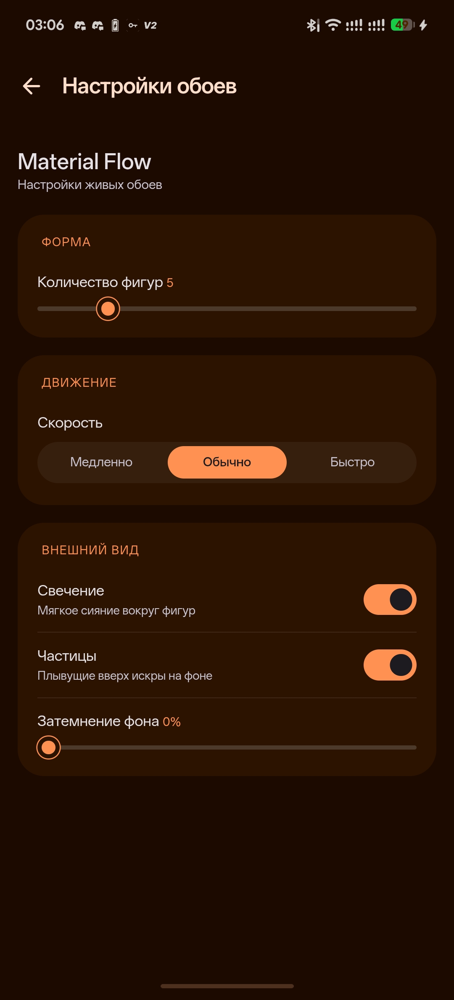

# Material Flow

Живые обои с мягкими градиентными фигурами в стиле Material 3. Палитра автоматически
подстраивается под системные цвета Material You и светлую или тёмную тему устройства.

## Особенности

- плавно движущиеся градиентные фигуры;
- системная палитра Material You;
- отдельная реакция на включение экрана и разблокировку;
- разлёт фигур в новые случайные позиции;
- мягкое свечение и фоновые частицы;
- поддержка светлой и тёмной темы;
- работает полностью офлайн.

## Настройки

Можно изменить:

- количество фигур;
- скорость движения;
- свечение;
- фоновые частицы;
- степень затемнения фона.

## Требования

- Wallify 1.0.0 или новее;
- Android 8.0 или новее;
- для динамической палитры Material You рекомендуется Android 12 или новее.

Автор: [@YouRooni](https://t.me/YouRooni)
