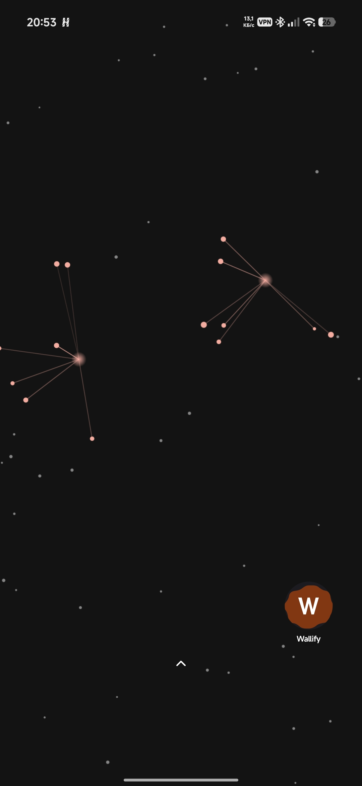
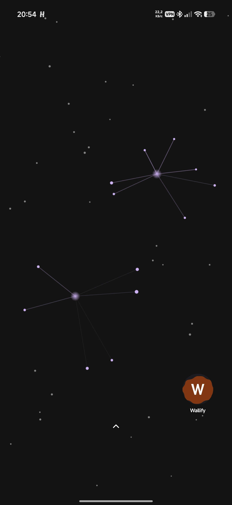

# Particle Web
### 1.0.0

Светлые партиклы на темном фоне с произвольным движением
При касании соединяются в "паутину" с центром в точке касания

---

## Что делает

Рисует партиклы с произвольным движением
При касании образует "паутину" с центром в точке касания
Цвет: `primary` из Monet палитры

---

## Скриншоты

### Красный:

### Фиолетовый:

---

## Требования

* Приложение **Wallify** версии `1.0.0` и выше
* Не зависит от акселерометра (гироскопа)
* Комплект не помечен как энергоэффективный (`isLite` установлено на значение `false`)

---

### by [rich_beluga](https://t.me/rich_beluga)